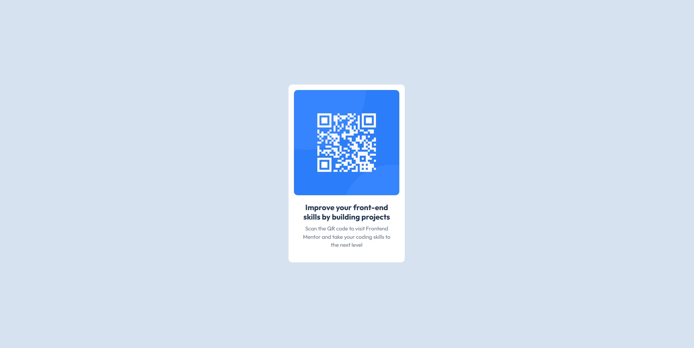

# Frontend Mentor - QR code component solution

This is a solution to the [QR code component challenge on Frontend Mentor](https://www.frontendmentor.io/challenges/qr-code-component-iux_sIO_H) on Frontend Mentor This challenge helped me practice structuring HTML and styling with CSS to build a simple and responsive QR code card.  

## Table of contents

- [Overview](#overview) 
- [Screenshot](#screenshot)
- [Links](#links)
- [My process](#my-process) 
- [Built with](#built-with) 
- [What I learned](#what-i-learned) 
- [Continued development](#continued-development) 
- [Useful resources](#useful-resources) 
- [Author](#author)
- [Acknowledgments](#acknowledgments)


## Overview
- QR code component

### Screenshot



### Links

- Solution URL: [Add solution URL here](https://www.frontendmentor.io/solutions/responsive-design-using-flexbox-rMo0oiyk9v)
- Live Site URL: [Add live site URL here](https://jayajo5.github.io/QR-Code-Challenge/)

## My process
I started by analyzing the provided design and breaking it into sections. The main structure consists of a container with a QR code image and a text description.

### Built with
- Semantic HTML5 markup
- CSS custom properties
- Flexbox
- Mobile-first workflow
- Google Fonts

### 📐 Structure & Layout 
# Structure:

  ```HTML
  <body>
  <div class="img-container">
      
    <div class="text">
      <h3>Improve your front-end skills by building projects</h3>
      <p>Scan the QR code to visit Frontend Mentor and take your coding skills to the next level</p>
    </div>
  </div>
</body>
```
# Layout: 
Page Layout (Body):
(Centering the QR Code was tricky, so I used below method to centering the QR code image.)
- Applied `display: flex;` `justify-content: center;` `align-items: center;` on the body to center the QR code card container both vertically and horizontally.
- `min-height: 100vh;` ensures the card stays centered even on smaller screens.

Card Container (.img-container):
- Used a `.img-container` div to hold the QR code and text (Act as a white box to hold the QR code and text).
- `width: 320px;` `height: 490px;` makes it a fixed-size card. (Also used `max-width: 90%;` for 📱 Responsive Design)
- `border-radius: 10px;` border radius for smooth and rounded corners.
- Used `overflow: hidden;` on .img-container to clip the image properly. Currently, border-radius: 10px; on img is applying to the whole image, but if the image overflows, the corners might not be rounded properly, so here we used overflow:hidden; property.

QR Code Image (.img-container img):
- `width: 100%;` makes sure the image fills the container width. (Also used `max-width: 100%;` to Ensures the image doesn’t stretch beyond its natural size.)
- `height: auto;` ensures aspect ratio is maintained.
- `border-radius: 10px;` rounds the corners slightly.

Text Section (.text):
- `text-align: center;` ensures the heading and description are centered.
- `padding: 16px;` adds spacing around text.

Heading (.text h3):
- Used given `color: hsl(218, 44%, 22%);` for better contrast.

Description (.text p):
- Give `padding-top:9px;` space between the heading to paragraph description.
- `font-size: 15px;` makes the description slightly smaller than the heading.
- `color: hsl(216, 15%, 48%);` to makes it less dominant than the heading.
- Give `line-height: 1.5;` to improves text spacing for improves readability.

### 📱 Responsive Design
OR Code Container - (.img-container):
- `max-width: 90%; width: 320px;` This ensures the card stays 320px wide on larger screens but shrinks when the screen is too small (below 320px width).
- Helps on small mobile screens where 320px might overflow.

OR Code Image - (.img-container img):
- `max-width: 100%;` Ensures the image doesn’t stretch beyond its natural size. If the container is larger than 300px, the image stays at 300px (because of max-width).
- Prevents distortion when resizing the container.

### What I learned
- I learned how to center a container using `display:flex;`
- I learned `min-height: 100vh;` property to ensures the card stays centered even on smaller screens.
- I learned how to use `overflow: hidden;` to prevent unwanted scrollbars.
- I learned responsive design using `max-width` property using below css properties.

```CSS
.img-container{
    background-color: white;
    height: 490px;
    width: 320px;
    max-width: 90%; /*responsive*/
    margin: auto;
    padding: 15px;
    border-radius: 10px;
    overflow: hidden;
}
.img-container img{
    max-width: 100%; /*responsive*/
    height: auto;                 
    border-radius: 10px;
}
```
### Continued development

- I want to add animations when hovering over the QR code. 
- Add a hover effect for a smoother user experience. 
- Experiment with `box-shadow` to enhance the design. 
- In future projects i want to learn to apply media queries.

### Useful resources

- [CSS Tricks](https://css-tricks.com/centering-css-complete-guide/) - This helped me for Centering in CSS. I really liked this pattern and will use it going forward.
- [MDN Web Docs](https://developer.mozilla.org/en-US/docs/Glossary/Flexbox) - This is an amazing free resource which helped me finally understand Flexbox. I'd recommend it to anyone still learning this concept.

## Author

- GitHub - [@Jayajo5](https://github.com/Jayajo5)
- Frontend Mentor - [@Jayajo5](https://www.frontendmentor.io/profile/Jayajo5)

## Acknowledgments

A big thanks to the Frontend Mentor community for feedback and inspiration! 🚀


